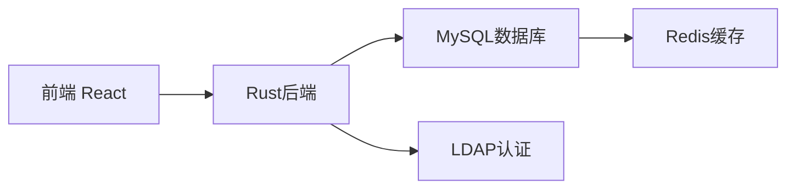

# 项目简报：图书馆管理系统

## 执行摘要
开发基于Rust的现代化图书馆管理系统，采用前后端分离架构和MySQL数据库，为中小型图书馆提供高效的图书管理、借阅追踪和用户服务。

## 技术选型
### 后端框架
- **推荐框架**：
  1. Actix-web：高性能异步框架（生产环境首选）
  2. Rocket：开发体验优异，内置配置系统
  3. Warp：轻量级，基于Filter架构

- **数据库**：MySQL 8.0+ 
- **API规范**：RESTful + OpenAPI 3.0

### 前端架构
- React 18 + TypeScript
- Chakra UI组件库
- Vite构建工具

## MVP核心功能
1. **图书管理**
   - 图书入库/下架
   - ISBN扫描录入
   - 多条件检索（书名/作者/分类）
   
2. **借阅管理**
   - 借书/还书/续借操作
   - 借阅历史查询
   - 逾期提醒（基础版）

3. **用户系统**
   - 读者分级（普通/VIP）
   - 权限控制（读者/管理员）
   - 基础个人信息管理

4. **报表功能**
   - 实时库存统计
   - 月度借阅量分析
   - 热门图书排行榜

## 技术约束

## 下一步计划
1. 创建PRD文档（使用`*create-doc prd`命令）
2. 架构设计（数据库Schema + API规范）
3. 创建项目仓库并初始化