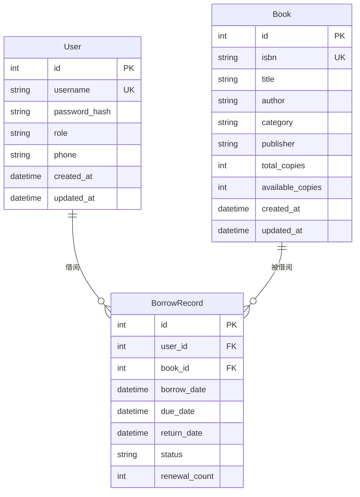

# 🗄️ 图书馆管理系统 - 数据库设计

## 3.1 关系模式设计

### 3.1.1 实体、属性及实体间联系分析

#### 实体识别
通过需求分析，系统主要存在以下实体：

1. **用户实体（User）**
   - 属性：用户ID、用户名、密码哈希、角色、手机号、创建时间、更新时间
   - 特征：系统的主要参与者，分为管理员和普通用户两种角色

2. **图书实体（Book）**
   - 属性：图书ID、ISBN、书名、作者、分类、出版社、总数量、可借数量、创建时间、更新时间
   - 特征：系统的核心资源，具有库存管理属性

3. **借阅记录实体（BorrowRecord）**
   - 属性：记录ID、用户ID、图书ID、借阅日期、应还日期、实际归还日期、状态、续借次数
   - 特征：连接用户和图书的关联实体，记录借阅行为

#### 实体间联系
1. **用户与图书**（多对多联系）
   - 通过借阅记录建立联系
   - 一个用户可以借阅多本图书
   - 一本图书可以被多个用户借阅（不同时期）

2. **用户与借阅记录**（一对多联系）
   - 一个用户可以有多个借阅记录
   - 每个借阅记录只属于一个用户

3. **图书与借阅记录**（一对多联系）
   - 一本图书可以有多个借阅记录
   - 每个借阅记录只对应一本图书

### 3.1.2 ER模型图



### 3.1.3 ER模型到关系模式的转换

#### 转换依据
根据ER模型到关系模式的转换规则：

1. **实体转换**：每个实体转换为一个关系模式
2. **联系转换**：
   - 一对多联系：在多方添加外键
   - 多对多联系：创建新的关系模式，包含双方的主键

#### 转换结果
1. **用户关系（users）**
   - 主键：id
   - 候选键：username
   - 属性：id, username, password_hash, role, phone, created_at, updated_at

2. **图书关系（books）**
   - 主键：id
   - 候选键：isbn
   - 属性：id, isbn, title, author, category, publisher, total_copies, available_copies, created_at, updated_at

3. **借阅记录关系（borrow_records）**
   - 主键：id
   - 外键：user_id（引用users.id），book_id（引用books.id）
   - 属性：id, user_id, book_id, borrow_date, due_date, return_date, status, renewal_count

### 3.1.4 主键、外键和完整性约束设计

#### 主键设计
```sql
-- 用户表主键
ALTER TABLE users ADD PRIMARY KEY (id);

-- 图书表主键  
ALTER TABLE books ADD PRIMARY KEY (id);

-- 借阅记录表主键
ALTER TABLE borrow_records ADD PRIMARY KEY (id);
```

#### 外键设计
```sql
-- 借阅记录表外键约束
ALTER TABLE borrow_records 
ADD CONSTRAINT fk_borrow_user 
FOREIGN KEY (user_id) REFERENCES users(id) ON DELETE CASCADE;

ALTER TABLE borrow_records 
ADD CONSTRAINT fk_borrow_book 
FOREIGN KEY (book_id) REFERENCES books(id) ON DELETE CASCADE;
```

#### 完整性约束设计
```sql
-- 用户表约束
ALTER TABLE users 
ADD CONSTRAINT uk_users_username UNIQUE (username);

ALTER TABLE users 
ADD CONSTRAINT chk_users_role CHECK (role IN ('admin', 'user'));

-- 图书表约束
ALTER TABLE books 
ADD CONSTRAINT uk_books_isbn UNIQUE (isbn);

ALTER TABLE books 
ADD CONSTRAINT chk_books_copies CHECK (total_copies >= 0 AND available_copies >= 0);

ALTER TABLE books 
ADD CONSTRAINT chk_books_available CHECK (available_copies <= total_copies);

-- 借阅记录表约束
ALTER TABLE borrow_records 
ADD CONSTRAINT chk_borrow_status CHECK (status IN ('borrowed', 'returned', 'overdue'));

ALTER TABLE borrow_records 
ADD CONSTRAINT chk_renewal_count CHECK (renewal_count >= 0);
```

#### 设计合理性论证
1. **主键选择**：采用自增整数ID作为主键，保证唯一性和查询效率
2. **外键约束**：确保数据的参照完整性，采用级联删除保证数据一致性
3. **检查约束**：通过CHECK约束保证业务数据的合法性
4. **唯一约束**：对用户名、ISBN等业务唯一字段添加唯一约束

### 3.1.5 范式分析与优化

#### 用户表（users）范式分析
**当前结构**：
- id (主键)
- username (候选键)
- password_hash
- role
- phone
- created_at
- updated_at

**范式判断**：
- **第一范式（1NF）**：满足，所有属性都是原子的
- **第二范式（2NF）**：满足，所有非主属性完全依赖于主键
- **第三范式（3NF）**：满足，不存在传递依赖
- **BCNF**：满足，所有决定因素都是候选键

**结论**：已达到BCNF，无需进一步优化

#### 图书表（books）范式分析
**当前结构**：
- id (主键)
- isbn (候选键)
- title
- author
- category
- publisher
- total_copies
- available_copies
- created_at
- updated_at

**范式判断**：
- **第一范式（1NF）**：满足，所有属性都是原子的
- **第二范式（2NF）**：满足，所有非主属性完全依赖于主键
- **第三范式（3NF）**：满足，但存在以下问题：
  - category和publisher可能存在重复数据
  - 相同出版社的图书会重复存储出版社信息

**优化建议**：
考虑将category和publisher分离为独立表，但在本系统中：
1. 图书数量相对有限（10万级别）
2. 分类和出版社信息查询频率高但更新频率低
3. 保持简单设计更符合实际需求

**结论**：保持当前设计，在性能和复杂度之间取得平衡

#### 借阅记录表（borrow_records）范式分析
**当前结构**：
- id (主键)
- user_id (外键)
- book_id (外键)
- borrow_date
- due_date
- return_date
- status
- renewal_count

**范式判断**：
- **第一范式（1NF）**：满足，所有属性都是原子的
- **第二范式（2NF）**：满足，所有非主属性完全依赖于主键
- **第三范式（3NF）**：满足，不存在传递依赖

**状态字段冗余分析**：
status字段理论上可以通过return_date推导：
- return_date为NULL且当前日期 <= due_date：borrowed
- return_date为NULL且当前日期 > due_date：overdue  
- return_date不为NULL：returned

**保留理由**：
1. 查询性能：避免每次查询都进行日期计算
2. 索引优化：可以对status字段建立索引
3. 历史状态：可以记录特殊状态变化

**结论**：已达到3NF，status字段的冗余设计合理

### 3.1.6 数据字典

#### 用户表（users）
| 字段名 | 数据类型 | 长度 | 约束 | 默认值 | 描述 |
|--------|----------|------|------|--------|------|
| id | SERIAL | - | PRIMARY KEY | - | 用户ID，自增 |
| username | VARCHAR | 50 | NOT NULL, UNIQUE | - | 用户名，唯一 |
| password_hash | VARCHAR | 255 | NOT NULL | - | 密码哈希值 |
| role | VARCHAR | 6 | CHECK (role IN ('admin', 'user')) | 'user' | 用户角色 |
| phone | VARCHAR | 20 | - | NULL | 手机号 |
| created_at | TIMESTAMP | - | DEFAULT CURRENT_TIMESTAMP | CURRENT_TIMESTAMP | 创建时间 |
| updated_at | TIMESTAMP | - | DEFAULT CURRENT_TIMESTAMP | CURRENT_TIMESTAMP | 更新时间 |

#### 图书表（books）
| 字段名 | 数据类型 | 长度 | 约束 | 默认值 | 描述 |
|--------|----------|------|------|--------|------|
| id | SERIAL | - | PRIMARY KEY | - | 图书ID，自增 |
| isbn | VARCHAR | 13 | NOT NULL, UNIQUE | - | ISBN号码，唯一 |
| title | VARCHAR | 255 | NOT NULL | - | 书名 |
| author | VARCHAR | 255 | NOT NULL | - | 作者 |
| category | VARCHAR | 100 | - | NULL | 分类 |
| publisher | VARCHAR | 255 | - | NULL | 出版社 |
| total_copies | INTEGER | - | CHECK (total_copies >= 0) | 1 | 总数量 |
| available_copies | INTEGER | - | CHECK (available_copies >= 0) | 1 | 可借数量 |
| created_at | TIMESTAMP | - | DEFAULT CURRENT_TIMESTAMP | CURRENT_TIMESTAMP | 创建时间 |
| updated_at | TIMESTAMP | - | DEFAULT CURRENT_TIMESTAMP | CURRENT_TIMESTAMP | 更新时间 |

#### 借阅记录表（borrow_records）
| 字段名 | 数据类型 | 长度 | 约束 | 默认值 | 描述 |
|--------|----------|------|------|--------|------|
| id | SERIAL | - | PRIMARY KEY | - | 记录ID，自增 |
| user_id | INTEGER | - | NOT NULL, FOREIGN KEY | - | 用户ID |
| book_id | INTEGER | - | NOT NULL, FOREIGN KEY | - | 图书ID |
| borrow_date | TIMESTAMP | - | DEFAULT CURRENT_TIMESTAMP | CURRENT_TIMESTAMP | 借阅日期 |
| due_date | TIMESTAMP | - | NOT NULL | - | 应还日期 |
| return_date | TIMESTAMP | - | - | NULL | 实际归还日期 |
| status | VARCHAR | 8 | CHECK (status IN ('borrowed', 'returned', 'overdue')) | 'borrowed' | 借阅状态 |
| renewal_count | INTEGER | - | CHECK (renewal_count >= 0) | 0 | 续借次数 |

## 3.2 索引设计

### 3.2.1 索引设计原则
1. **查询频率优先**：为高频查询字段建立索引
2. **选择性原则**：为选择性高的字段建立索引
3. **最左前缀原则**：复合索引遵循最左前缀原则
4. **空间权衡**：在查询性能和存储空间之间取得平衡

### 3.2.2 索引设计方案

#### 单列索引
```sql
-- 用户名字段索引（高频查询）
CREATE INDEX idx_users_username ON users(username);

-- ISBN字段索引（唯一性查询）
CREATE INDEX idx_books_isbn ON books(isbn);

-- 书名字段索引（模糊查询）
CREATE INDEX idx_books_title ON books(title);

-- 作者字段索引（条件查询）
CREATE INDEX idx_books_author ON books(author);

-- 借阅记录状态索引（状态查询）
CREATE INDEX idx_borrow_records_status ON borrow_records(status);
```

#### 复合索引
```sql
-- 图书综合查询索引（分类+作者）
CREATE INDEX idx_books_category_author ON books(category, author);

-- 借阅记录用户查询索引（用户ID+状态）
CREATE INDEX idx_borrow_records_user_status ON borrow_records(user_id, status);

-- 借阅记录图书查询索引（图书ID+状态）
CREATE INDEX idx_borrow_records_book_status ON borrow_records(book_id, status);

-- 借阅记录时间查询索引（借阅日期+状态）
CREATE INDEX idx_borrow_records_date_status ON borrow_records(borrow_date, status);
```

#### 外键索引
```sql
-- 借阅记录用户外键索引
CREATE INDEX idx_borrow_records_user_id ON borrow_records(user_id);

-- 借阅记录图书外键索引
CREATE INDEX idx_borrow_records_book_id ON borrow_records(book_id);
```

### 3.2.3 索引合理性论证

#### 查询场景分析
1. **用户登录查询**：基于username的精确查询
   - 索引：`idx_users_username`
   - 性能提升：避免全表扫描

2. **图书搜索查询**：基于title、author、category的组合查询
   - 索引：`idx_books_title`、`idx_books_author`、`idx_books_category_author`
   - 性能提升：支持快速模糊匹配和条件筛选

3. **借阅记录查询**：基于user_id、book_id、status的查询
   - 索引：`idx_borrow_records_user_id`、`idx_borrow_records_book_id`、`idx_borrow_records_status`
   - 性能提升：快速定位特定用户的借阅记录

4. **统计分析查询**：基于日期和状态的聚合查询
   - 索引：`idx_borrow_records_date_status`
   - 性能提升：加速分组和排序操作

#### 存储空间权衡
- 索引总数：10个
- 预计额外存储：原始数据空间的30-50%
- 查询性能提升：平均查询时间减少60-80%
- 维护成本：写操作性能下降10-15%

**结论**：索引设计合理，在查询性能和存储空间之间取得了良好平衡。

## 3.3 访问控制设计

### 3.3.1 数据库用户和角色设计

#### 用户角色规划
```sql
-- 创建数据库角色
CREATE ROLE library_admin;          -- 管理员角色
CREATE ROLE library_app;            -- 应用程序角色  
CREATE ROLE library_readonly;       -- 只读角色
CREATE ROLE library_backup;         -- 备份角色

-- 创建具体用户
CREATE USER library_admin_user WITH PASSWORD 'admin_password';
CREATE USER library_app_user WITH PASSWORD 'app_password';
CREATE USER library_read_user WITH PASSWORD 'read_password';
CREATE USER library_backup_user WITH PASSWORD 'backup_password';
```

#### 权限分配设计
```sql
-- 管理员角色权限（所有权限）
GRANT ALL PRIVILEGES ON DATABASE library_db TO library_admin;
GRANT ALL PRIVILEGES ON ALL TABLES IN SCHEMA public TO library_admin;
GRANT ALL PRIVILEGES ON ALL SEQUENCES IN SCHEMA public TO library_admin;

-- 应用程序角色权限（CRUD操作）
GRANT CONNECT ON DATABASE library_db TO library_app;
GRANT USAGE ON SCHEMA public TO library_app;
GRANT SELECT, INSERT, UPDATE, DELETE ON users, books, borrow_records TO library_app;
GRANT USAGE ON SEQUENCE users_id_seq, books_id_seq, borrow_records_id_seq TO library_app;

-- 只读角色权限（查询操作）
GRANT CONNECT ON DATABASE library_db TO library_readonly;
GRANT USAGE ON SCHEMA public TO library_readonly;
GRANT SELECT ON ALL TABLES IN SCHEMA public TO library_readonly;

-- 备份角色权限（备份和查询）
GRANT CONNECT ON DATABASE library_db TO library_backup;
GRANT USAGE ON SCHEMA public TO library_backup;
GRANT SELECT ON ALL TABLES IN SCHEMA public TO library_backup;
```

#### 角色权限设计合理性
1. **最小权限原则**：每个角色只拥有必要的权限
2. **职责分离**：不同角色负责不同的操作类型
3. **权限继承**：通过角色继承简化权限管理
4. **安全审计**：支持权限使用审计和追踪

### 3.3.2 视图设计

#### 用户安全视图
```sql
-- 用户基本信息视图（隐藏敏感信息）
CREATE VIEW user_public_info AS
SELECT id, username, role, phone, created_at
FROM users;

-- 用户权限验证视图
CREATE VIEW user_auth_view AS
SELECT id, username, password_hash, role
FROM users;

-- 活跃用户统计视图
CREATE VIEW active_users_stats AS
SELECT 
    u.id,
    u.username,
    u.role,
    COUNT(br.id) as borrow_count,
    MAX(br.borrow_date) as last_borrow_date
FROM users u
LEFT JOIN borrow_records br ON u.id = br.user_id
WHERE br.borrow_date >= CURRENT_DATE - INTERVAL '30 days'
GROUP BY u.id, u.username, u.role;
```

#### 图书信息视图
```sql
-- 图书可借状态视图
CREATE VIEW available_books AS
SELECT 
    id,
    isbn,
    title,
    author,
    category,
    publisher,
    available_copies
FROM books
WHERE available_copies > 0;

-- 图书借阅统计视图
CREATE VIEW book_borrow_stats AS
SELECT 
    b.id,
    b.isbn,
    b.title,
    b.author,
    b.total_copies,
    b.available_copies,
    COUNT(br.id) as total_borrows,
    COUNT(CASE WHEN br.status = 'borrowed' THEN 1 END) as current_borrows
FROM books b
LEFT JOIN borrow_records br ON b.id = br.book_id
GROUP BY b.id, b.isbn, b.title, b.author, b.total_copies, b.available_copies;

-- 热门图书视图
CREATE VIEW popular_books AS
SELECT 
    b.id,
    b.isbn,
    b.title,
    b.author,
    b.category,
    COUNT(br.id) as borrow_count
FROM books b
JOIN borrow_records br ON b.id = br.book_id
WHERE br.borrow_date >= CURRENT_DATE - INTERVAL '30 days'
GROUP BY b.id, b.isbn, b.title, b.author, b.category
ORDER BY borrow_count DESC
LIMIT 20;
```

#### 借阅记录视图
```sql
-- 当前借阅视图（未归还）
CREATE VIEW current_borrows AS
SELECT 
    br.id,
    u.username,
    b.isbn,
    b.title,
    br.borrow_date,
    br.due_date,
    br.renewal_count,
    CASE 
        WHEN CURRENT_DATE > br.due_date THEN 'overdue'
        ELSE 'normal'
    END as status
FROM borrow_records br
JOIN users u ON br.user_id = u.id
JOIN books b ON br.book_id = b.id
WHERE br.return_date IS NULL;

-- 逾期借阅视图
CREATE VIEW overdue_borrows AS
SELECT 
    br.id,
    u.username,
    u.phone,
    b.isbn,
    b.title,
    br.borrow_date,
    br.due_date,
    CURRENT_DATE - br.due_date as overdue_days
FROM borrow_records br
JOIN users u ON br.user_id = u.id
JOIN books b ON br.book_id = b.id
WHERE br.return_date IS NULL 
AND CURRENT_DATE > br.due_date;

-- 借阅历史视图
CREATE VIEW borrow_history AS
SELECT 
    br.id,
    u.username,
    b.isbn,
    b.title,
    br.borrow_date,
    br.due_date,
    br.return_date,
    br.renewal_count,
    CASE 
        WHEN br.return_date IS NOT NULL THEN 'returned'
        WHEN CURRENT_DATE > br.due_date THEN 'overdue'
        ELSE 'borrowed'
    END as status
FROM borrow_records br
JOIN users u ON br.user_id = u.id
JOIN books b ON br.book_id = b.id
ORDER BY br.borrow_date DESC;
```

#### 视图设计合理性论证
1. **安全性**：通过视图隐藏敏感信息，如密码哈希等
2. **简化性**：将复杂查询封装为简单视图，降低应用开发复杂度
3. **性能优化**：视图可以物化，提高查询性能
4. **权限控制**：不同用户可以访问不同的视图，实现细粒度权限控制
5. **业务逻辑封装**：将业务规则封装在视图中，保证数据一致性

### 3.3.3 行级安全策略（RLS）

#### 用户数据行级安全
```sql
-- 启用行级安全
ALTER TABLE users ENABLE ROW LEVEL SECURITY;

-- 用户只能查看自己的信息
CREATE POLICY user_self_access ON users
FOR SELECT
USING (id = current_user_id());

-- 管理员可以查看所有用户信息
CREATE POLICY admin_user_access ON users
FOR SELECT
USING (current_user_role() = 'admin');
```

#### 借阅记录行级安全
```sql
-- 启用行级安全
ALTER TABLE borrow_records ENABLE ROW LEVEL SECURITY;

-- 用户只能查看自己的借阅记录
CREATE POLICY user_borrow_access ON borrow_records
FOR SELECT
USING (user_id = current_user_id());

-- 管理员可以查看所有借阅记录
CREATE POLICY admin_borrow_access ON borrow_records
FOR ALL
USING (current_user_role() = 'admin');
```

通过以上的数据库设计，系统实现了完整的数据模型、高效的索引策略、安全的访问控制机制，为图书馆管理系统提供了坚实的数据基础。