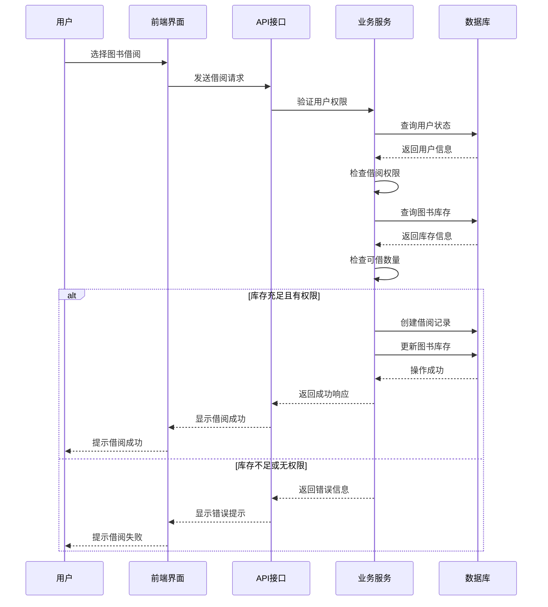
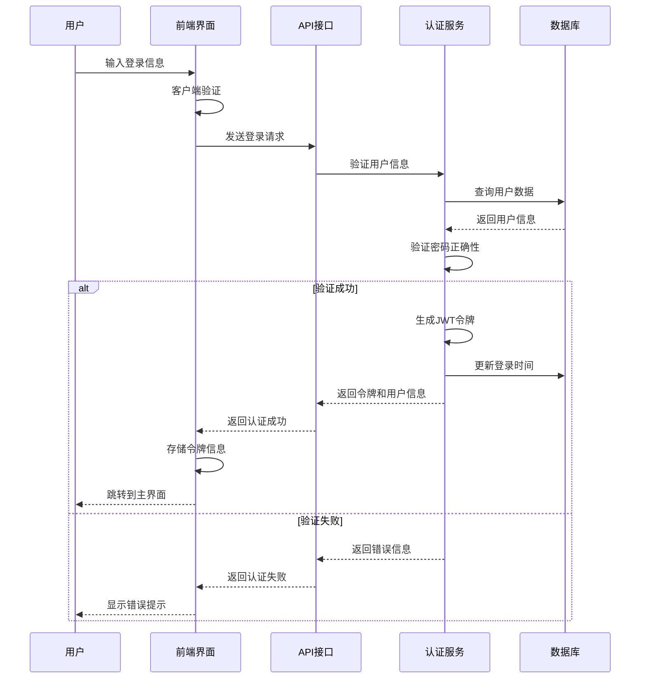

# 🏗️ 图书馆管理系统 - 概要设计

## 一、系统总体架构

### 1.1 系统架构图

```
┌─────────────────────────────────────────────────────────────┐
│                    前端表现层 (React + TypeScript)               │
├─────────────────────────────────────────────────────────────┤
│  ┌─────────────┐ ┌─────────────┐ ┌─────────────┐ ┌─────────────┐ │
│  │  图书管理界面 │ │  用户管理界面 │ │  借阅管理界面 │ │  统计分析界面 │ │
│  └─────────────┘ └─────────────┘ └─────────────┘ └─────────────┘ │
│  ┌─────────────┐ ┌─────────────┐ ┌─────────────┐ ┌─────────────┐ │
│  │  登录注册界面 │ │  图书搜索界面 │ │  借阅历史界面 │ │  系统管理界面 │ │
│  └─────────────┘ └─────────────┘ └─────────────┘ └─────────────┘ │
└─────────────────────────────────────────────────────────────┘
                              │
                              ▼
┌─────────────────────────────────────────────────────────────┐
│                   API网关 (JWT认证 + 权限控制)                  │
├─────────────────────────────────────────────────────────────┤
│  ┌─────────────┐ ┌─────────────┐ ┌─────────────┐ ┌─────────────┐ │
│  │  图书管理API │ │  用户管理API │ │  借阅管理API │ │  统计分析API │ │
│  └─────────────┘ └─────────────┘ └─────────────┘ └─────────────┘ │
└─────────────────────────────────────────────────────────────┘
                              │
                              ▼
┌─────────────────────────────────────────────────────────────┐
│                 业务逻辑层 (Rust + Actix-web)                   │
├─────────────────────────────────────────────────────────────┤
│  ┌─────────────┐ ┌─────────────┐ ┌─────────────┐ ┌─────────────┐ │
│  │  图书服务模块 │ │  用户服务模块 │ │  借阅服务模块 │ │  统计服务模块 │ │
│  └─────────────┘ └─────────────┘ └─────────────┘ └─────────────┘ │
│  ┌─────────────┐ ┌─────────────┐ ┌─────────────┐ ┌─────────────┐ │
│  │  权限控制模块 │ │  数据验证模块 │ │  事务管理模块 │ │  异常处理模块 │ │
│  └─────────────┘ └─────────────┘ └─────────────┘ └─────────────┘ │
└─────────────────────────────────────────────────────────────┘
                              │
                              ▼
┌─────────────────────────────────────────────────────────────┐
│                   数据访问层 (Diesel ORM)                       │
├─────────────────────────────────────────────────────────────┤
│  ┌─────────────┐ ┌─────────────┐ ┌─────────────┐ ┌─────────────┐ │
│  │  用户数据访问 │ │  图书数据访问 │ │  借阅数据访问 │ │  统计数据访问 │ │
│  └─────────────┘ └─────────────┘ └─────────────┘ └─────────────┘ │
└─────────────────────────────────────────────────────────────┘
                              │
                              ▼
┌─────────────────────────────────────────────────────────────┐
│                    数据存储层 (MySQL数据库)                      │
├─────────────────────────────────────────────────────────────┤
│  ┌─────────────┐ ┌─────────────┐ ┌─────────────┐ ┌─────────────┐ │
│  │    users    │ │    books    │ │borrow_records│ │   indexes   │ │
│  └─────────────┘ └─────────────┘ └─────────────┘ └─────────────┘ │
└─────────────────────────────────────────────────────────────┘
```

### 1.2 技术架构分层

#### 1.2.1 表现层（Presentation Layer）
- **技术栈**：React 18 + TypeScript + Vite
- **主要职责**：
  - 用户界面展示和交互
  - 表单验证和数据绑定
  - 响应式布局设计
  - 客户端路由管理
- **核心组件**：
  - 图书管理组件（BookList, BookForm, BookDetail）
  - 用户认证组件（Login, Register）
  - 借阅管理组件（BorrowBook, BorrowHistory）
  - 统计分析组件（InventoryStats, PopularBooks）

#### 1.2.2 业务逻辑层（Business Logic Layer）
- **技术栈**：Rust + Actix-web框架
- **主要职责**：
  - 业务规则处理和验证
  - 权限控制和认证授权
  - 事务管理和数据一致性
  - 异常处理和错误响应
- **核心模块**：
  - 图书服务模块（book service）
  - 用户服务模块（user service）
  - 借阅服务模块（borrow service）
  - 统计服务模块（statistics service）

#### 1.2.3 数据访问层（Data Access Layer）
- **技术栈**：Diesel ORM + MySQL
- **主要职责**：
  - 数据库连接管理
  - SQL查询构建和执行
  - 数据模型映射
  - 事务处理支持
- **核心功能**：
  - CRUD操作封装
  - 复杂查询构建
  - 连接池管理
  - 数据库迁移支持

#### 1.2.4 数据存储层（Data Storage Layer）
- **技术栈**：MySQL关系型数据库
- **主要职责**：
  - 数据持久化存储
  - 数据完整性保证
  - 索引优化和查询性能
  - 备份和恢复机制
- **核心表结构**：
  - 用户表（users）
  - 图书表（books）
  - 借阅记录表（borrow_records）

## 二、功能模块设计

### 2.1 图书管理模块

#### 2.1.1 功能结构图
```
图书管理模块
├── 图书录入
│   ├── ISBN验证
│   ├── 基本信息录入
│   └── 库存设置
├── 图书查询
│   ├── 条件搜索
│   ├── 分页显示
│   └── 详情查看
├── 图书修改
│   ├── 信息更新
│   ├── 库存调整
│   └── 状态变更
└── 图书删除
    ├── 存在性检查
    ├── 借阅状态验证
    └── 级联删除处理
```

#### 2.1.2 核心功能分析
- **图书录入**：支持ISBN自动验证、基本信息录入、库存数量设置
- **图书查询**：多条件组合查询、分页展示、详情查看
- **图书修改**：信息更新、库存调整、支持部分字段更新
- **图书删除**：安全性检查、借阅状态验证、软删除机制

### 2.2 用户管理模块

#### 2.2.1 功能结构图
```
用户管理模块
├── 用户注册
│   ├── 用户名验证
│   ├── 密码强度检查
│   └── 手机号验证
├── 用户登录
│   ├── 身份认证
│   ├── JWT令牌生成
│   └── 权限验证
├── 用户信息管理
│   ├── 基本信息维护
│   ├── 密码修改
│   └── 权限分配
└── 用户查询
    ├── 用户列表
    ├── 详情查看
    └── 权限管理
```

#### 2.2.2 核心功能分析
- **用户注册**：用户名唯一性验证、密码强度要求、手机号格式验证
- **用户登录**：基于JWT的无状态认证、支持记住登录状态
- **权限管理**：RBAC权限模型、角色权限分配、细粒度权限控制
- **用户信息**：基本信息维护、密码安全策略、个人信息保护

### 2.3 借阅管理模块

#### 2.3.1 功能结构图
```
借阅管理模块
├── 图书借阅
│   ├── 库存检查
│   ├── 借阅限制验证
│   ├── 借阅记录创建
│   └── 库存更新
├── 图书归还
│   ├── 借阅记录查询
│   ├── 归还处理
│   ├── 库存恢复
│   └── 逾期检查
├── 图书续借
│   ├── 续借资格验证
│   ├── 续借次数检查
│   ├── 到期时间更新
│   └── 续借记录更新
└── 借阅历史
    ├── 个人借阅记录
    ├── 借阅状态查询
    └── 历史数据统计
```

#### 2.3.2 核心功能分析
- **图书借阅**：库存实时检查、借阅权限验证、事务一致性保证
- **图书归还**：自动逾期计算、库存状态更新、归还记录维护
- **图书续借**：续借资格验证、续借次数限制、到期时间延长
- **借阅历史**：个人借阅记录查询、借阅状态跟踪、历史数据分析

### 2.4 统计分析模块

#### 2.4.1 功能结构图
```
统计分析模块
├── 库存统计
│   ├── 总图书数量
│   ├── 分类统计
│   └── 可借数量分析
├── 借阅排行
│   ├── 热门图书排行
│   ├── 借阅次数统计
│   └── 时间段筛选
├── 用户分析
│   ├── 活跃用户统计
│   ├── 借阅频率分析
│   └── 用户行为分析
└── 运营分析
    ├── 借阅趋势分析
    ├── 逾期统计分析
    └── 图书利用率分析
```

#### 2.4.2 核心功能分析
- **库存统计**：实时库存监控、分类数量统计、可借状态分析
- **借阅排行**：基于借阅次数的热门图书排行、支持时间段筛选
- **用户分析**：用户活跃度统计、借阅行为模式分析
- **运营分析**：借阅趋势预测、逾期率统计、图书利用率评估

## 三、系统流程设计

### 3.1 图书借阅流程



### 3.2 用户认证流程



## 四、接口设计规范

### 4.1 RESTful API设计

#### 4.1.1 图书管理接口
- `GET /api/books` - 获取图书列表
- `POST /api/books` - 添加新图书
- `GET /api/books/{id}` - 获取图书详情
- `PUT /api/books/{id}` - 更新图书信息
- `DELETE /api/books/{id}` - 删除图书

#### 4.1.2 用户管理接口
- `POST /api/auth/register` - 用户注册
- `POST /api/auth/login` - 用户登录
- `GET /api/users/profile` - 获取用户信息
- `PUT /api/users/profile` - 更新用户信息

#### 4.1.3 借阅管理接口
- `POST /api/borrows` - 创建借阅记录
- `PUT /api/borrows/{id}/return` - 归还图书
- `PUT /api/borrows/{id}/renew` - 续借图书
- `GET /api/borrows/history` - 获取借阅历史

### 4.2 数据格式规范

#### 4.2.1 请求响应格式
```json
// 成功响应
{
    "code": 200,
    "message": "操作成功",
    "data": {
        // 具体数据
    }
}

// 错误响应
{
    "code": 400,
    "message": "错误描述",
    "error": "详细错误信息"
}
```

#### 4.2.2 分页数据格式
```json
{
    "code": 200,
    "message": "查询成功",
    "data": {
        "items": [
            // 数据列表
        ],
        "total": 100,
        "page": 1,
        "page_size": 10,
        "total_pages": 10
    }
}
```

## 五、安全设计

### 5.1 认证授权机制
- **JWT令牌认证**：无状态认证机制，支持分布式部署
- **角色权限控制**：基于RBAC模型的权限管理
- **细粒度权限**：支持接口级别的权限控制
- **令牌刷新**：支持令牌自动刷新机制

### 5.2 数据安全措施
- **密码加密存储**：使用Argon2算法进行密码哈希
- **输入数据验证**：防止SQL注入和XSS攻击
- **敏感信息脱敏**：用户敏感信息脱敏处理
- **数据传输加密**：支持HTTPS协议传输

### 5.3 系统安全防护
- **接口限流**：防止恶意请求和DDoS攻击
- **错误信息处理**：避免泄露系统内部信息
- **日志审计**：记录重要操作和异常信息
- **安全headers**：设置安全相关的HTTP头

## 六、性能设计

### 6.1 性能优化策略
- **数据库索引优化**：针对查询频繁的字段建立索引
- **连接池管理**：数据库连接池复用，减少连接开销
- **缓存机制**：对热点数据进行缓存，减少数据库访问
- **前端优化**：代码分割、懒加载、资源压缩

### 6.2 性能指标
- **响应时间**：API接口响应时间小于200ms
- **并发处理**：支持100个并发用户同时访问
- **数据容量**：支持10万条图书记录存储
- **系统可用性**：99.9%的系统可用性保证

## 七、扩展性设计

### 7.1 功能扩展性
- **模块化设计**：各功能模块独立，便于扩展新功能
- **插件机制**：支持通过插件方式扩展系统功能
- **配置化管理**：通过配置文件支持功能开关和参数调整
- **接口扩展**：RESTful API设计支持版本管理和功能扩展

### 7.2 技术扩展性
- **微服务架构**：支持将系统拆分为独立的微服务
- **云原生支持**：支持容器化部署和云服务集成
- **多数据库支持**：支持多种关系型数据库
- **分布式部署**：支持分布式部署和负载均衡

本概要设计文档为图书馆管理系统的整体架构提供了详细的设计方案，涵盖了系统架构、功能模块、流程设计、接口规范、安全设计、性能设计和扩展性设计等各个方面，为系统的具体实现提供了清晰的技术指导。